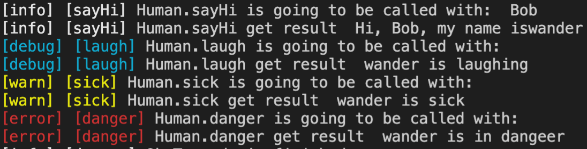

#  ts-logger [中文](./readme.zh.md)

1. Tip

    - nodejs
    - colorful
    - decorator

2. usage

    ```typescript
    import Logger from '../src/index';

    // init
    const logger = new Logger('HumanLog');

    // middlewares for [inspect]
    logger.applyMiddlewares([
      {
        before: ({classname, methodname, logger}, ...args) => {
          logger.record(`${classname}.${methodname} is going to be called with: `, ...args);
        },
        after: ({classname, methodname, logger}, result) => {
          logger.record(`${classname}.${methodname} get result `, result);
        },
      }
    ])


    class Human {
      private name: string;
      constructor(name: string) {
        this.name = name;
      }

      // inspect default level
      @logger.inspect('sayHi')
      sayHi(name: string) {
        return `Hi, ${name}, my name is${this.name}`
      }

      // inspect debug
      @logger.inspect('laugh', 'debug')
      laugh() {
        return `${this.name} is laughing`
      }

      // inspect warn
      @logger.inspect('sick', 'warn')
      sick() {
        return `${this.name} is sick`
      }

      // inspect error
      @logger.inspect('danger', 'error')
      danger() {
        return `${this.name} is in dangeer`
      }
    }

    const wander = new Human('wander');

    wander.sayHi('Bob');
    wander.laugh();
    wander.sick();
    wander.danger();

    logger.record('Ok Ts code is finished')
    ```

3. works like


